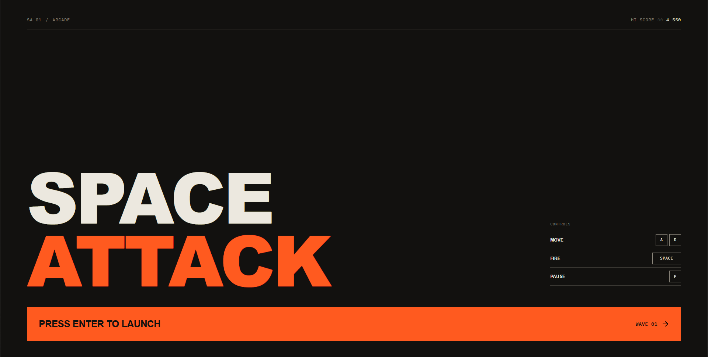

# Space Attack

A responsive browser arcade game built with HTML, CSS, and JavaScript.

## Play locally

Serve this folder with any static web server and open `index.html` from that server. The game uses several pages, relative asset paths, browser storage for scores, and local audio files.

## Controls

- `A` / `D` or the left and right arrow keys: move
- `Space`: fire
- `P`: pause or resume
- `Enter`: launch or restart

## GitHub Pages

This is a static site and does not need a build step. In the repository, open **Settings → Pages**, select **Deploy from a branch**, choose `main` and `/(root)`, and save. GitHub will show the published URL when deployment completes.

The game source and bundled audio assets are included in this repository. Confirm you have redistribution rights for the audio before making the repository public.
